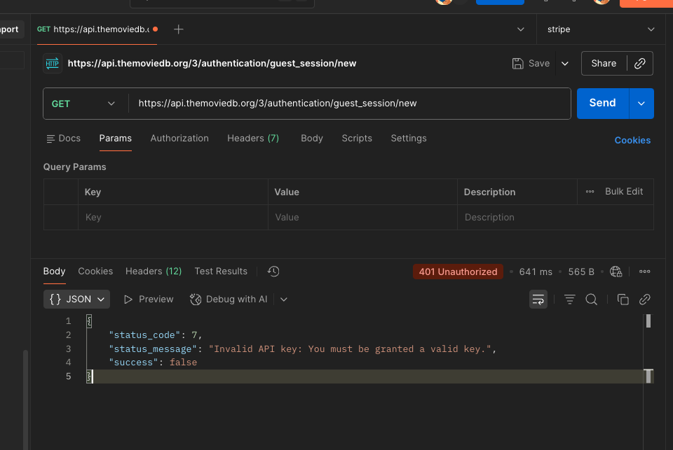

# Answer the Following Questions

### What does the single responsibility principle consist of? What's its purpose?

It means a class or function should have only one job. Its purpose is to make code easier to understand, test, and maintain.-

### What characteristics does “good” or clean code have?

Simple and easy to read, Well-organized, Consistent naming,No duplicated logic, Easy to test and maintain, Clear responsibilities

### Detail how you would do everything that you have not completed.

I have an error with the API at the moment to create an session Id, I got this error


I couldn't test correctly however I created mocks to help me.

# Pop Corn

# Architecture

Feature based architecture

```
assets/
   ├─ fonts
   └─ icons
src/

├─ context # in the future this will be removed
├─shared/
│   ├─ components # components'd be imported in containers or in multiple features
│   ├─ containers # containers'd be imported in screens or in multiple features
│   ├─hooks #hooks'd be imported in multiple features
│   ├─ services/
│   │   ├─ api
│   │   └─ arraySorter
├─ data/
│   ├─ dto
│   └─ mappers
├─ features/
│   ├─ [name-feature]/
│   │   ├─ components/
│   │   ├─ constants/
│   │   ├─ containers/
│   │   ├─ data/
│   │   │   ├─ dto
│   │   │   └─ mappers
│   │   ├─ entities/
│   │   ├─ hooks/ # integrations of services with react-query
│   │   ├─ navigation/
│   │   ├─ screens/
│   │   ├─ store/ # whole from module in core will be moving in the layer for each feature
│   │   │   ├─ actions
│   │   │   ├─ reducers
│   │   │   └─ selectors
│   │   ├─ services/ # integration of API
│   │   └─ skeleton/
├─ navigators/
├─ routes/
├─ theme/ # it'll be rename for theme
│   ├─ constants/
│   │   ├─ hooks/
│   │   ├─ types/
│   │   ├─ variants/
│   │   ├─ lightTheme
│   │   ├─ theme.core
│   │   └─ themeProvider
└─ ui/ # components connected with theme restStyle components for standards of styles and spacing
      ├─ components/
      ├─ hooks/
      ├─ types/
      ├─ utils/
      └─ index
```

# builds

You can see the changeLog here [ChangeLog](./CHANGELOG.md).

# libraries

# Commit Message Guidelines

This project enforces commit message standards to maintain a clear and organized git history.

## Commit Message Format

All commit messages must follow this format:

```bash
<Type>: <description>
```

### Required Rules

1. **Minimum Length**: Commit messages must be at least 10 characters long
2. **Type Required**: Every commit must start with one of the valid types followed by a colon
3. **Description Required**: A clear, descriptive message explaining the change

### Valid Commit Types

| Type      | Description      | When to Use                                                      |
| --------- | ---------------- | ---------------------------------------------------------------- |
| `Added`   | New features     | Adding new functionality, components, or features                |
| `Changed` | Modifications    | Modifying existing functionality or updating code                |
| `Removed` | Features removed | Removing features, code, or dependencies                         |
| `Fixed`   | Bug fixes        | Fixing bugs, errors, or issues                                   |
| `Build`   | Version updates  | App version bumps, build number changes, or code version updates |

## Examples

### ✅ Good Commit Messages

```bash
git commit -m "added: user authentication with JWT tokens"
git commit -m "fixed: crash on startup when network is unavailable"
git commit -m "changed: updated home screen UI to match new design"
git commit -m "removed: deprecated API v1 endpoints"
git commit -m "added: dark mode support for all screens"
git commit -m "fixed: memory leak in image loading component"
```

### ❌ Bad Commit Messages

```bash
git commit -m "fix"                    # Too short
git commit -m "updated stuff"          # No type, vague description
git commit -m "feat: new feature"      # Wrong type (use 'Added')
git commit -m "fixed bug"              # Too short, not descriptive
git commit -m "changes"                # No type, too vague
```

## Pre-Commit Hooks

This project uses Husky and lint-staged to enforce code quality:
What Gets Checked Before Each Commit

1. ESLint: Code is linted for errors and warnings

   - ❌ Commits are blocked if any errors or warnings are found
   - Fix issues before committing or use --no-verify to bypass (not recommended)

2. Prettier: Code formatting is automatically applied

   - Code is formatted consistently across the project

3. Commit Message Validation: Message format is checked
   - Must follow the format above
   - Must be descriptive enough

## Tips for Writing Good Commit Messages

Be specific: Explain what changed and why

1. Use present tense: "Added feature" not "Add feature" or "Adding feature"
2. Focus on the what and why: Not the how (code shows the how)
3. Keep it concise but descriptive: One line should be enough to understand the change
4. Reference issues when relevant: "Fixed: login crash (closes #123)"

Questions?
If you have questions about commit message format or the pre-commit hooks, please reach out to the team or check the project documentation.

# Questions?

If you have questions about commit message format or the pre-commit hooks, please reach out to the team or check the project documentation.
